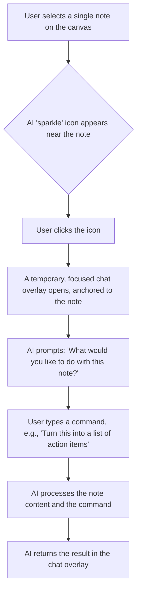
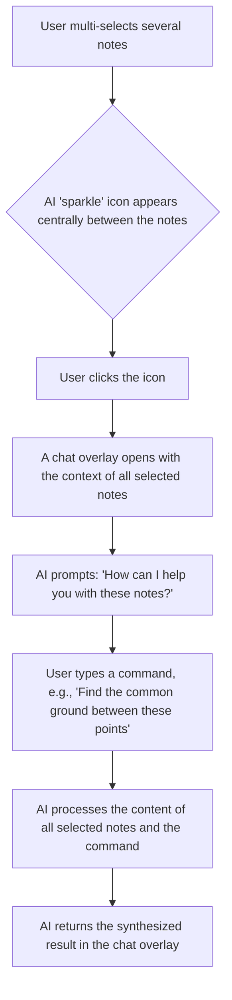
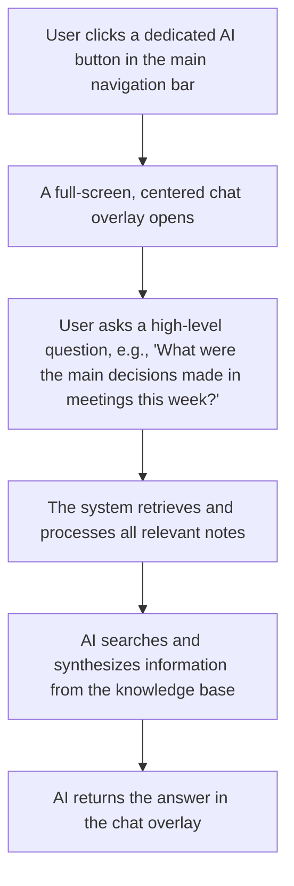

# AI Chat Implementation Plan: The Momentum Notes Approach

## Overview

This document outlines the implementation plan for a contextual, on-demand AI chat feature in Momentum Notes. This approach moves away from a traditional, persistent chat sidebar and instead integrates AI assistance directly into the user's workflow, making it more intuitive, powerful, and aligned with our minimalist design goals.

The core principle is to provide AI assistance exactly when and where the user needs it, with the relevant context already understood.

## Key Scenarios

We will implement three core chat scenarios:

1.  **Focused Chat:** For interacting with a single note.
2.  **Synthesis Chat:** For interacting with multiple selected notes.
3.  **Global Chat:** For interacting with the entire knowledge base.

---

### 1. Scenario: The Focused Chat (Single Note)

**Objective:** Allow users to perform AI-driven actions on a single note, such as rewriting, expanding, or summarizing.

**Workflow:**

**Technical Implementation Steps:**
-   **UI:**
    -   Detect single note selection on the canvas.
    -   Render an AI "sparkle" icon adjacent to the selected note.
    -   On icon click, render a modal or popover chat interface. The chat component should be visually anchored to the note.
-   **State Management:**
    -   The application state needs to track the currently selected note's ID and content.
    -   When the chat is initiated, this context is passed to the AI service.
-   **AI Integration:**
    -   The chat input and the note's content will be sent to the AI model.
    -   The AI's response will be displayed in the chat interface.

---

### 2. Scenario: The Synthesis Chat (Multiple Notes)

**Objective:** Enable users to synthesize information from multiple notes, leveraging the spatial nature of the canvas.

**Workflow:**

**Technical Implementation Steps:**
-   **UI:**
    -   Implement multi-select functionality on the canvas (e.g., Shift+click, drag-to-select).
    -   Calculate a central position between the selected notes to render the AI "sparkle" icon.
    -   On icon click, open a chat overlay.
-   **State Management:**
    -   Maintain a list of selected note IDs and their content in the application state.
    -   Pass the combined content of all selected notes to the AI service upon chat initiation.
-   **AI Integration:**
    -   Concatenate or structure the content from the selected notes into a single prompt for the AI model.
    -   The user's command will guide the synthesis task.

---

### 3. Scenario: The Global Chat (Entire Knowledge Base)

**Objective:** Provide a high-level "command center" for users to ask questions about their entire collection of notes.

**Workflow:**

**Technical Implementation Steps:**
-   **UI:**
    -   Add a dedicated AI button to the top-level application navigation.
    -   On click, render a full-screen modal for the chat interface. This creates a focused "command center" mode.
-   **Data Retrieval:**
    -   This is the most complex part. We need an efficient way to search the user's entire note collection.
    -   Initial implementation could involve a simple text search across all notes in the local database (`db.ts`).
    -   A more advanced implementation could involve creating vector embeddings for each note to enable semantic search.
-   **AI Integration:**
    -   The user's query will be used to find relevant notes.
    -   The content of the relevant notes will be passed to the AI model as context for answering the user's question.

## Implementation Plan

This project will be broken down into the following phases:

1.  **Phase 1: Focused Chat (Single Note)**
    -   Implement the UI for selecting a single note and displaying the AI icon.
    -   Create the focused chat component.
    -   Integrate with the AI service for single-note tasks.
2.  **Phase 2: Synthesis Chat (Multiple Notes)**
    -   Implement multi-select functionality on the canvas.
    -   Develop the logic for positioning the AI icon and handling the chat context for multiple notes.
3.  **Phase 3: Global Chat (Knowledge Base)**
    -   Implement the full-screen chat UI.
    -   Develop the backend/client-side logic for searching all notes.
    -   (Optional) Investigate and implement vector embeddings for semantic search.

This phased approach will allow us to deliver value incrementally and gather user feedback at each stage.