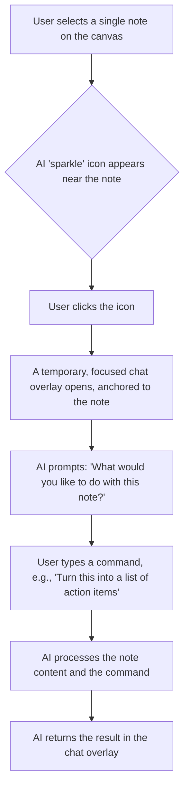

# AI Chat Implementation Summary

## Overview

This document summarizes the implementation of a contextual, on-demand AI chat feature in Synapse Notes. This approach moves away from a traditional, persistent chat sidebar and instead integrates AI assistance directly into the user's workflow, making it more intuitive, powerful, and aligned with our minimalist design goals.

The core principle is to provide AI assistance exactly when and where the user needs it, with the relevant context already understood.

## Key Scenarios

The following chat scenario was implemented:

1.  **Focused Chat:** For interacting with a single note.

---

### 1. Scenario: The Focused Chat (Single Note)

**Objective:** Allow users to perform AI-driven actions on a single note, such as rewriting, expanding, or summarizing.

**Workflow:**

**Technical Implementation:**
-   **UI:**
    -   Detects single note selection on the canvas.
    -   Renders an AI "sparkle" icon adjacent to the selected note.
    -   On icon click, renders a modal or popover chat interface. The chat component is visually anchored to the note.
-   **State Management:**
    -   The application state tracks the currently selected note's ID and content.
    -   When the chat is initiated, this context is passed to the AI service.
-   **AI Integration:**
    -   The chat input and the note's content are sent to the AI model.
    -   The AI's response is displayed in the chat interface.

---

## Implementation Summary

The **Focused Chat (Single Note)** feature was implemented as follows:
- The UI for selecting a single note and displaying the AI icon was implemented.
- The focused chat component was created.
- The AI service was integrated for single-note tasks.