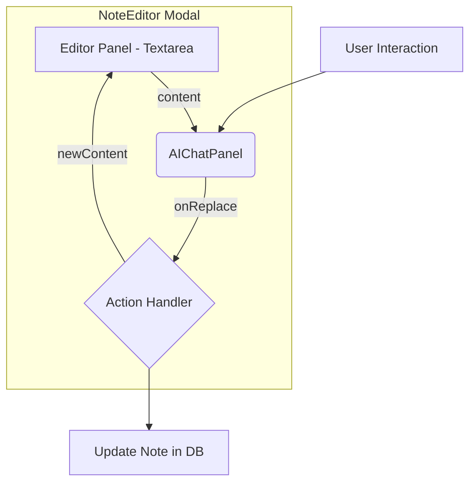

# AI Editor Integration Summary

## 1. Overview

This document summarizes the architectural evolution of the AI Chat feature from a canvas-based popover into a fully integrated panel within the `NoteEditor`. This strategic shift addresses key user feedback regarding context and workflow, creating a single, powerful "AI-Assisted Editing" mode.

This approach is superior because it provides the user with the full context of their note while interacting with the AI, and seamlessly blends AI-powered actions with manual editing.

---

## 2. Core Architectural Changes

The implementation focused on modifying the `NoteEditor` to become a two-panel component: the main text editor on one side, and the new AI Chat panel docked to the other.

### Key Components:

1.  **`NoteEditor.tsx` (Major Refactor):**
    *   The main modal component was widened to accommodate two panels.
    *   It manages the state of the note's `title` and `content` as it currently does.
    *   It now also manages the visibility of the AI Chat panel.
    *   It contains the logic to update the note's content based on actions from the AI Chat panel.

2.  **`AIChatPanel.tsx` (New Component):**
    *   This is a new, reusable component that encapsulates the chat functionality.
    *   It is visually docked inside the `NoteEditor`.
    *   It receives the current note's content as a prop for context.
    *   It emits events when the user clicks an action button (e.g., "Replace Content").

### Data Flow Diagram:

---

## 3. Detailed Implementation Summary

### Step 1: Created the `AIChatPanel.tsx` Component

*   **Action:** Created a new file `src/components/AIChatPanel.tsx`.
*   **Details:**
    *   This component contains the chat UI (message history, input form).
    *   It was adapted from the logic in the previous `FocusedAIChat.tsx`.
    *   **Props:**
        *   `note: Note`: The full note object for context.
        *   `onReplaceContent: (newContent: string) => void`: Callback to replace the editor's text.
        *   `onInsertContent: (contentToInsert: string) => void`: Callback to append text.
    *   The component handles its own internal state for messages and user input.

### Step 2: Refactored `NoteEditor.tsx`

*   **Action:** Modified the existing `NoteEditor.tsx` to integrate the `AIChatPanel`.
*   **Details:**
    *   **UI:**
        *   Updated the layout to a two-column grid (e.g., using Flexbox or CSS Grid). The main editor takes up ~60-70% of the width, and the `AIChatPanel` takes the remaining ~30-40%.
        *   Added a "Sparkle" AI icon button to the `NoteEditor`'s toolbar to toggle the visibility of the `AIChatPanel`.
    *   **State Management:**
        *   Added a new state variable, `isAIChatVisible`, to control the panel's visibility.
    *   **Action Handlers:**
        *   Implemented the `handleReplaceContent` and `handleInsertContent` functions. These update the local state of the note's content, which is bound to the main textarea.

### Step 3: Deprecated the Canvas-Based Chat

*   **Action:** Removed the popover-based chat logic from `CanvasView.tsx`.
*   **Details:**
    *   The "sparkle" icon that appeared next to a selected note on the canvas was removed. The entry point to the AI chat is now exclusively through the "Edit" button on the note, which opens the enhanced `NoteEditor`.
    *   The `FocusedAIChat.tsx` component was deleted after its logic was migrated to `AIChatPanel.tsx`.

---

## 4. Revised User Workflow

This new architecture results in a far more intuitive and powerful workflow:

1.  **Entry Point:** The user clicks the "Edit" button on any note card.
2.  **View:** The `NoteEditor` opens, showing the full note content.
3.  **AI Activation:** The user clicks the new AI "Sparkle" icon within the editor's toolbar.
4.  **Interaction:** The `AIChatPanel` slides into view next to the editor.
5.  **Full Context:** The user can now see their entire note and the AI chat side-by-side.
6.  **Action:** The user gives a command (e.g., "Summarize this"). The AI responds in the chat panel.
7.  **Application:** The user clicks "Replace Content," and the text in the main editor window is instantly updated.
8.  **Seamless Editing:** The user can then make manual refinements to the AI-generated text before saving and closing the editor.

This provides a superior, fully integrated AI editing experience.