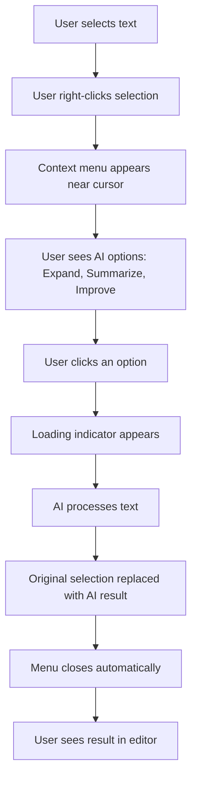
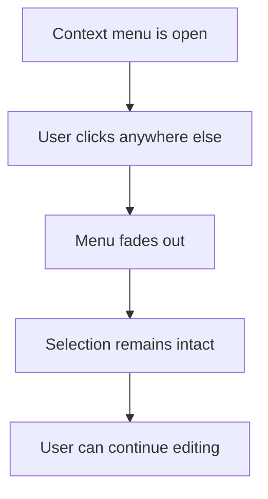
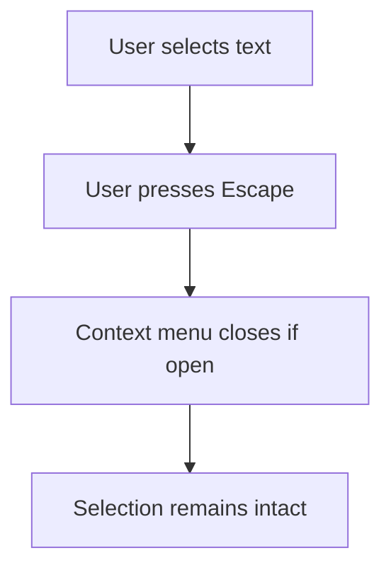

# Custom Context Menu Design & Implementation Plan

## Problem Statement

Users experience a frustrating workflow when trying to use AI tools on selected text:
1. User selects text in the editor
2. User clicks the "AI Tools" dropdown button
3. **Selection is lost** because focus shifts to the button
4. User cannot apply AI actions to their originally selected text

This breaks the natural flow and requires users to:
- Re-select text after opening the dropdown
- Use the dropdown blind without seeing what they're editing
- Experience friction in the editing workflow

## Solution: Custom Right-Click Context Menu

Implement a native-feeling context menu that appears on right-click over selected text, preserving the selection and providing instant access to AI actions.

---

## Design Philosophy

### Visual Design
- **Match Momentum Aesthetic**: Use the existing design system (Montserrat + Karla fonts, charcoal/solar yellow palette)
- **Light from the Sky**: Apply subtle top lighting and depth shadows
- **Glass Morphism**: Semi-transparent backdrop with blur effects
- **Smooth Animations**: Fade-in with scale and spring animations

### Interaction Design
- **Context-Aware**: Only show when text is selected
- **Smart Positioning**: Appear near mouse cursor, adjust to stay in viewport
- **Keyboard Accessible**: Support Escape to close
- **Visual Feedback**: Hover states, loading indicators, success animations

---

## Component Architecture

### 1. TextContextMenu Component

**Location**: `src/components/ui/TextContextMenu.tsx`

**Props Interface**:
```typescript
interface TextContextMenuProps {
  // Position from mouse event
  x: number
  y: number
  
  // Control visibility
  isOpen: boolean
  onClose: () => void
  
  // Selected text context
  selectedText: string
  
  // AI Action handlers
  onExpand: () => Promise<void>
  onSummarize: () => Promise<void>
  onImprove: () => Promise<void>
  
  // Loading states
  isLoading?: boolean
  
  // Optional: Custom menu items
  customActions?: ContextMenuAction[]
}

interface ContextMenuAction {
  id: string
  label: string
  icon: LucideIcon
  description?: string
  onClick: () => void | Promise<void>
  disabled?: boolean
  keyboard?: string
}
```

### 2. Hook: useTextSelection

**Location**: `src/hooks/useTextSelection.ts`

**Purpose**: Manage text selection state and context menu visibility

```typescript
interface UseTextSelectionOptions {
  elementRef: RefObject<HTMLTextAreaElement>
  onSelectionChange?: (text: string) => void
}

interface UseTextSelectionReturn {
  selectedText: string
  selectionRange: { start: number, end: number } | null
  isTextSelected: boolean
  
  // Context menu state
  contextMenuState: {
    isOpen: boolean
    x: number
    y: number
  }
  
  // Methods
  handleContextMenu: (e: MouseEvent) => void
  closeContextMenu: () => void
  replaceSelection: (newText: string) => void
}
```

---

## Implementation Plan

### Phase 1: Core Context Menu Component

**Features**:
- Render at specific x, y coordinates
- Portal rendering (outside normal DOM flow)
- Click-outside detection to close
- Escape key handling
- Momentum-themed styling

**Component Structure**:
```tsx
<Portal>
  <div className="context-menu-backdrop" onClick={onClose}>
    <div 
      className="context-menu" 
      style={{ top: y, left: x }}
      onClick={e => e.stopPropagation()}
    >
      <div className="context-menu-header">
        <Sparkles />
        AI Tools
      </div>
      
      <div className="context-menu-items">
        {actions.map(action => (
          <ContextMenuItem 
            key={action.id}
            {...action}
          />
        ))}
      </div>
      
      {isLoading && <LoadingIndicator />}
    </div>
  </div>
</Portal>
```

### Phase 2: Smart Positioning Logic

**Requirements**:
- Calculate menu position relative to mouse
- Adjust if menu would overflow viewport edges
- Add offset from cursor for better UX

**Algorithm**:
```typescript
function calculateMenuPosition(
  mouseX: number,
  mouseY: number,
  menuWidth: number,
  menuHeight: number,
  viewport: { width: number, height: number }
): { x: number, y: number } {
  const offset = 8 // pixels from cursor
  
  let x = mouseX + offset
  let y = mouseY + offset
  
  // Check right edge
  if (x + menuWidth > viewport.width) {
    x = mouseX - menuWidth - offset
  }
  
  // Check bottom edge
  if (y + menuHeight > viewport.height) {
    y = mouseY - menuHeight - offset
  }
  
  // Ensure not off-screen on left/top
  x = Math.max(offset, x)
  y = Math.max(offset, y)
  
  return { x, y }
}
```

### Phase 3: Text Selection Preservation

**Key Challenge**: Preventing selection loss on right-click

**Solution**:
```typescript
const handleContextMenu = (e: MouseEvent<HTMLTextAreaElement>) => {
  e.preventDefault() // Prevent default browser menu
  
  const textarea = textareaRef.current
  if (!textarea) return
  
  // Store selection before anything else
  const start = textarea.selectionStart
  const end = textarea.selectionEnd
  const text = textarea.value.substring(start, end)
  
  // Only show menu if text is selected
  if (text.trim().length === 0) return
  
  // Save selection state
  setSelectedText(text)
  setSelectionRange({ start, end })
  
  // Calculate position
  const { x, y } = calculateMenuPosition(
    e.clientX,
    e.clientY,
    menuWidth,
    menuHeight,
    { width: window.innerWidth, height: window.innerHeight }
  )
  
  setContextMenuState({ isOpen: true, x, y })
  
  // Restore focus to textarea (keeps selection)
  textarea.focus()
}
```

### Phase 4: Custom Cursor Styling

**Visual Indicator**: Show that selected text is interactive

**CSS**:
```css
/* When text is selected in editor */
.editor-textarea::selection {
  background-color: rgba(255, 215, 0, 0.3); /* Solar yellow with transparency */
  cursor: context-menu;
}

/* Custom cursor when hovering over selected text */
.editor-textarea.has-selection {
  cursor: context-menu;
}
```

### Phase 5: Integration with NoteEditor

**Modifications to** [`NoteEditor.tsx`](src/components/NoteEditor.tsx):

1. **Add the hook**:
```tsx
const {
  selectedText,
  selectionRange,
  contextMenuState,
  handleContextMenu,
  closeContextMenu,
  replaceSelection
} = useTextSelection({
  elementRef: textareaRef,
  onSelectionChange: setSelectedText
})
```

2. **Add context menu handler to textarea**:
```tsx
<textarea
  ref={textareaRef}
  onContextMenu={handleContextMenu}
  className="editor-textarea"
  // ... other props
/>
```

3. **Render context menu**:
```tsx
{contextMenuState.isOpen && (
  <TextContextMenu
    x={contextMenuState.x}
    y={contextMenuState.y}
    isOpen={contextMenuState.isOpen}
    onClose={closeContextMenu}
    selectedText={selectedText}
    onExpand={async () => {
      const expanded = await expandText(selectedText, title)
      replaceSelection(expanded)
      closeContextMenu()
    }}
    onSummarize={async () => {
      const summary = await summarizeText(selectedText, 'tl;dr')
      replaceSelection(summary)
      closeContextMenu()
    }}
    onImprove={async () => {
      const improved = await improveWriting(selectedText, 'more-formal')
      replaceSelection(improved)
      closeContextMenu()
    }}
    isLoading={aiLoading}
  />
)}
```

---

## Styling Specifications

### Context Menu Container
```css
.context-menu {
  /* Positioning */
  position: fixed;
  z-index: 9999;
  
  /* Momentum Glass Effect */
  background: rgba(255, 255, 255, 0.98);
  backdrop-filter: blur(20px);
  
  /* Borders & Shadows (Light from Sky) */
  border: 1px solid rgba(0, 0, 0, 0.08);
  border-radius: 12px;
  box-shadow:
    0 -1px 2px 0 rgba(255, 255, 255, 0.2) inset,
    0 12px 32px -8px rgba(0, 0, 0, 0.15),
    0 8px 16px -4px rgba(0, 0, 0, 0.08);
  
  /* Animation */
  animation: contextMenuIn 0.15s cubic-bezier(0.16, 1, 0.3, 1);
  transform-origin: top left;
  
  /* Layout */
  min-width: 220px;
  padding: 6px;
}

@keyframes contextMenuIn {
  from {
    opacity: 0;
    transform: scale(0.95) translateY(-4px);
  }
  to {
    opacity: 1;
    transform: scale(1) translateY(0);
  }
}
```

### Menu Item
```css
.context-menu-item {
  /* Layout */
  display: flex;
  align-items: center;
  gap: 12px;
  padding: 10px 12px;
  
  /* Typography */
  font-family: 'Karla', sans-serif;
  font-size: 14px;
  font-weight: 500;
  
  /* Styling */
  border-radius: 8px;
  cursor: pointer;
  transition: all 0.15s ease;
  
  /* Colors */
  color: #242424;
  background: transparent;
}

.context-menu-item:hover {
  background: rgba(255, 215, 0, 0.1); /* Solar yellow tint */
  color: #0a0a0a;
}

.context-menu-item:active {
  transform: scale(0.98);
}

.context-menu-item.disabled {
  opacity: 0.4;
  cursor: not-allowed;
  pointer-events: none;
}
```

### Icon Styling
```css
.context-menu-icon {
  width: 16px;
  height: 16px;
  color: #ffd700; /* Solar yellow */
  flex-shrink: 0;
}
```

---

## User Experience Flow

### Scenario 1: Right-Click on Selected Text


### Scenario 2: Click Outside to Dismiss


### Scenario 3: Keyboard Shortcut


---

## Dark Mode Considerations

```css
.dark .context-menu {
  background: rgba(23, 23, 23, 0.98);
  border-color: rgba(255, 255, 255, 0.08);
  box-shadow:
    0 -1px 2px 0 rgba(255, 255, 255, 0.05) inset,
    0 12px 32px -8px rgba(0, 0, 0, 0.4),
    0 8px 16px -4px rgba(0, 0, 0, 0.2);
}

.dark .context-menu-item {
  color: #f5f5f5;
}

.dark .context-menu-item:hover {
  background: rgba(255, 215, 0, 0.15);
  color: #fafafa;
}
```

---

## Accessibility Considerations

1. **Keyboard Navigation**:
   - Arrow