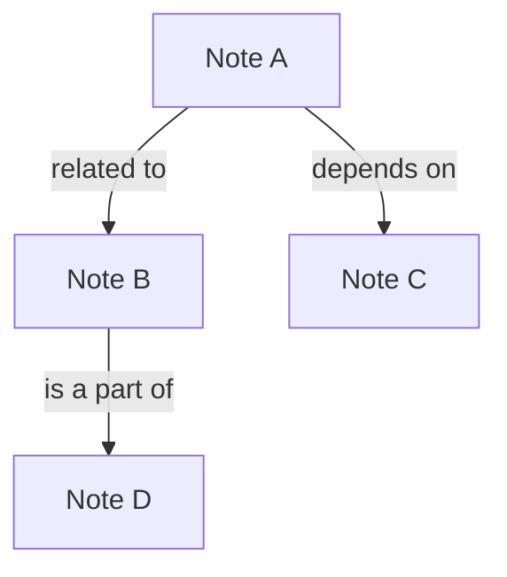

# Knowledge Graph Implementation Plan

## 1. Introduction

This document outlines the plan for implementing a Knowledge Graph feature in the note-taking application. The goal of this feature is to enhance the existing note connections functionality by introducing explicit relationship types and visualizations. This will allow users to create more meaningful and structured connections between their notes, transforming their note collection into a true knowledge graph.

## 2. Data Model

To support relationship types, the `NoteEdge` interface in `src/types/edge.ts` will be updated to include a `relationshipType` field. This field will be a string that can be used to define the type of relationship between two notes (e.g., "related to", "depends on", "is a part of").

### `src/types/edge.ts`

```typescript
export interface NoteEdge {
  id: string;
  source: string; // Source note ID
  target: string; // Target note ID
  createdAt: string; // ISO date
  label?: string; // Optional label for the connection
  relationshipType?: string; // e.g., "related to", "depends on"
}
## 3. UI/UX

The UI/UX will be updated to support the new relationship types. The following changes will be made:

*   **Connection Creation**: When a user creates a connection between two notes, they will be prompted to select a relationship type from a predefined list.
*   **Connection Visualization**: The relationship type will be displayed as a label on the connection line. Different relationship types can be visualized with different colors or line styles.
*   **Connection Filtering**: Users will be able to filter the connections displayed on the canvas based on their relationship type.

### Mockup


## 4. Implementation Details

The implementation of the Knowledge Graph feature will involve changes to the following files:

*   **`src/types/edge.ts`**: The `NoteEdge` interface will be updated to include the `relationshipType` field.
*   **`src/components/CanvasView.tsx`**: The `CanvasView` component will be updated to support the creation, visualization, and filtering of connections with relationship types.
*   **`src/lib/db.ts`**: The database schema will be updated to include the `relationshipType` field in the `edges` table.

### `src/components/CanvasView.tsx` Changes

The `handleConnect` function will be updated to prompt the user to select a relationship type when a new connection is created. The selected relationship type will be saved to the database along with the other connection details.

The component will also be updated to render the relationship type as a label on the connection line. This will be achieved by using the `label` prop of the `Edge` component from `@xyflow/react`.

Finally, a new UI component will be added to allow users to filter the connections displayed on the canvas based on their relationship type. This component will update the `edges` state of the `ReactFlow` component based on the user's selection.
## 5. Testing

The Knowledge Graph feature will be tested using a combination of unit tests, integration tests, and end-to-end tests.

*   **Unit Tests**: Unit tests will be written to test the individual components of the feature, such as the `CanvasView` component and the `db` library.
*   **Integration Tests**: Integration tests will be written to test the interaction between the different components of the feature, such as the UI and the database.
*   **End-to-End Tests**: End-to-end tests will be written to test the entire feature from the user's perspective, from creating a new connection to filtering the connections based on their relationship type.

## 6. Future Enhancements

The following are some potential future enhancements for the Knowledge Graph feature:

*   **Custom Relationship Types**: Allow users to define their own custom relationship types.
*   **Relationship Type Colors**: Allow users to assign different colors to different relationship types.
*   **Relationship Type Inference**: Use AI to automatically infer the relationship type between two notes based on their content.